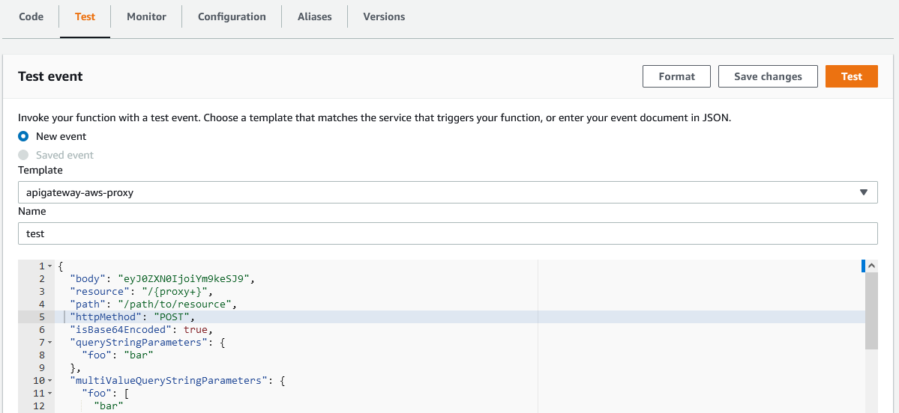
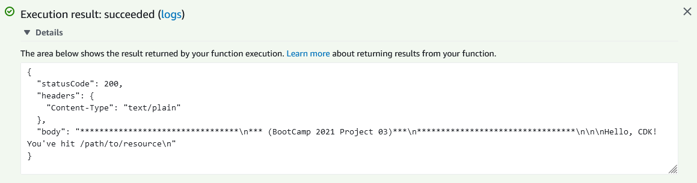
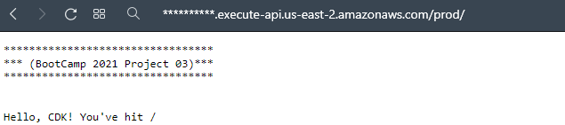
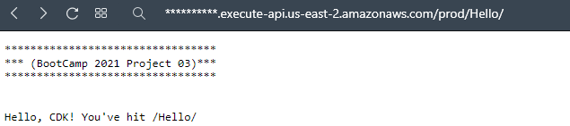
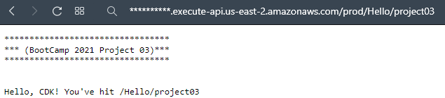
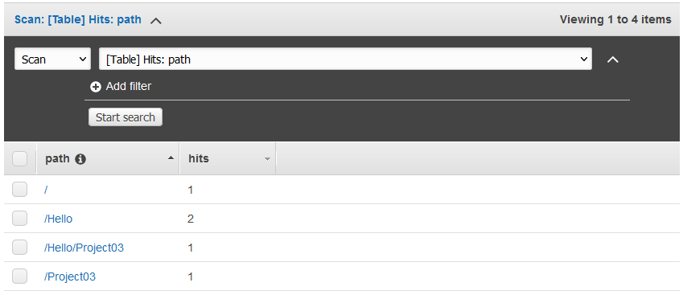
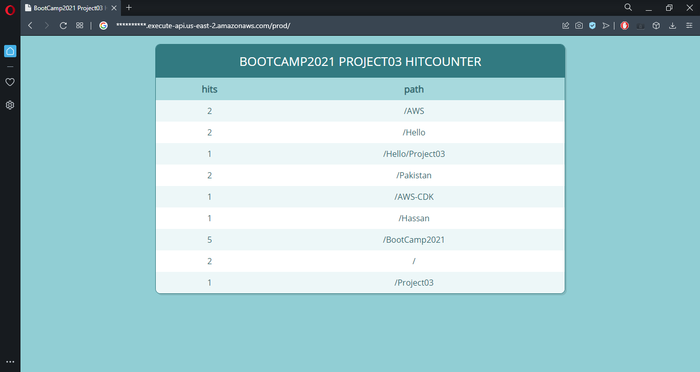
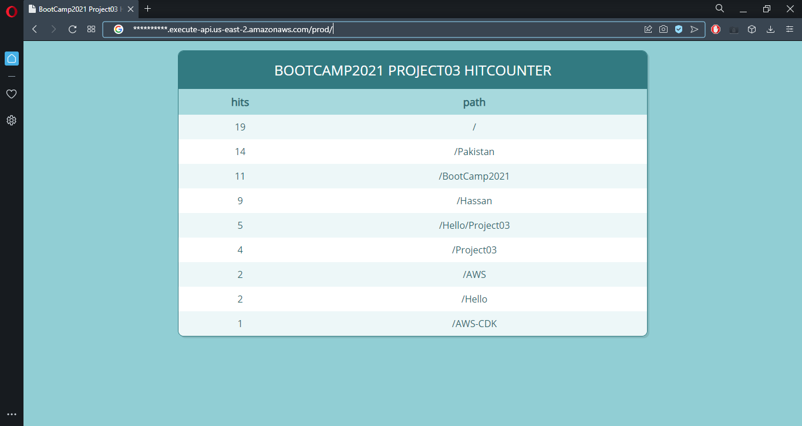

# BootCamp2021 Project03: HitCounter Api

By doing this project we are able to learn following:-

- How to create a cdk app
- How to deploy cdk app
- AWS lambda functions
- AWS api gateway
- DynamoDB

## Steps to code "HitCounter Api"

### 1. Create a basic cdk app

Create and navigate to new directory using `mkdir hitcounter-api && cd hitcounter-api`. Create a new cdk project using `cdk init app --language typescript`. As typescript is used for coding so transcribing the code to javascript is necessary, one way is to build the app in the end other is to use `npm run watch` to auto compile the code whenever any file is changed so use the latter option. To synthesize the app use `cdk synth` this will output the cloud formation template. Bootstrap the app using `cdk bootstrap` bootstrapping is necessary only in case when app is deployed for the first time. Deploy the app using `cdk deploy`.

### 2. Create HELLO lambda

To add a lambda function first install aws lambda construct library in the app using `npm install @aws-cdk/aws-lambda`. Update “lib/ hitcounter-api-stack.ts” to add a lambda function to the stack. Add a lambda handler code by creating “lambda/hello.ts”. Before deploying the code to the AWS first check the changes between last deployment and what we have in our app currently by using `cdk diff`. Use `cdk deploy` to deploy the app. After deployment navigate to AWS lambda cosnole and select deployed function, select test from the options and test the lambda function (for testing select options as shown in picture below).

Expand details in execution result to view the results of the test. Result of the test are as follows.

### 3. Add API Gateway

Adding an API Gateway in front of the hello lambda function will expose a public HTTPs endpoint which can be accessed by everyone. This means any request to the URL will be proxied to our lambda function and response will be returned back to user. To do so first install API gateway construct using `npm install @aws-cdk/aws-apigateway` and then update “lib/ hitcounter-api-stack.ts” to define an API endpoint and associate with the lambda function. Find the difference between last deployed app and current changes using `cdk diff` and deploy using `cdk deploy`. Test the app by navigating to the URL available as output when app is deployed. Test it by navigating to multiple paths.

### 4. Create HitCounter API

Create a HitCounter construct which can be attached to any lambda function which is used as API gateway backend. It will count how many requests are issued to each URL path and store this in DynamoDB table. Create HitCounter construct by creating a file “lib/hitcounter.ts”. Install DynamoDB construct using `npm install @aws-cdk/aws-dynamodb`. Add hitcounter lambda function and a dynamoDB table in the hitcounter construct. Create “lambda/hitcounter.ts” to define HitCounter handler. Install aws-sdk using `npm install aws-sdk`. In this handler update the dynamo table based on the path accessed and also call the downstream function and capture its response and return as output. In the HitCounter construct grant lambda function the permission to read and write to the lambda table and grant lambda role invoke permission to the downstream function. Deploy the App using `cdk deploy`.

### 5. Attach HitCounter API with hello function

Update “lib/ hitcounter-api-stack.ts” to add hitcounter API to the main stack. Attach hello function with the hitcounter API and use hitcounter function in the API gateway. Deploying the app using `cdk deploy` will give URL to acces the endpoint. Hitting the URL will output the same result as in step03 but accesing the tables from the DynamoDB console, list a table with number of hits to all the addresses.

### 6. Add table viewer library

One way to access the table is by accessing the DynamoDB console, other is to add some construct library to view in browser, so use cdk-dynamo-table-viewer to view the table. Install table viewer library using `npm install cdk-dynamo-table-viewer` and update “lib/hitcounter-api-stack.ts” to create a new table viewer. Also update “lib/hitcounter.ts” so table is exposed as public property. This time deploying the app not only gives a URL for hello lambda endpoint but also for HitCounter table.

### 7. Sort Table

Update “lib/ hitcounter-api-stack.ts” to configure the table viewer to sort the table by “hits” in descending order (ascending order is also possible).

### 8. Destroy App

Destroy App using `cdk destroy` as we don’t want our AWS resources to be used unnecessarily.

## Reading Material

- [CDK Workshop](https://cdkworkshop.com/20-typescript.html)
